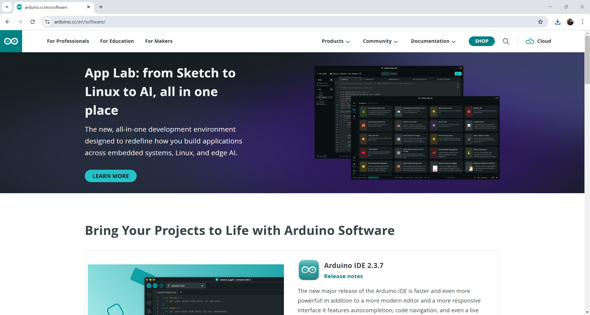
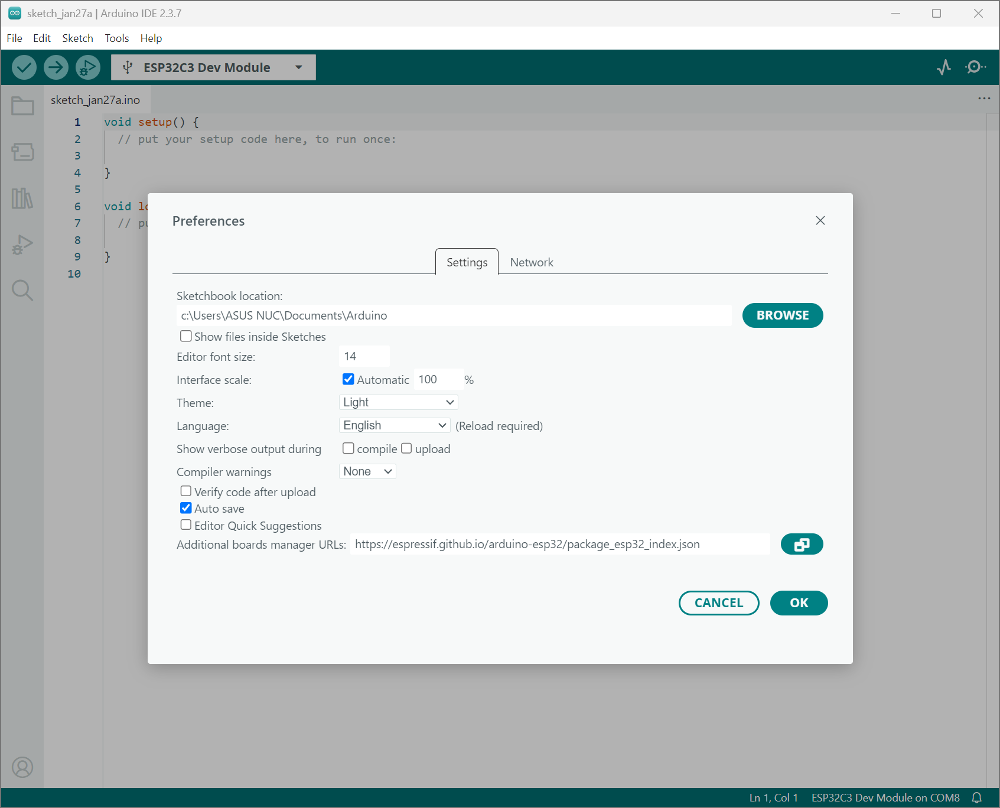
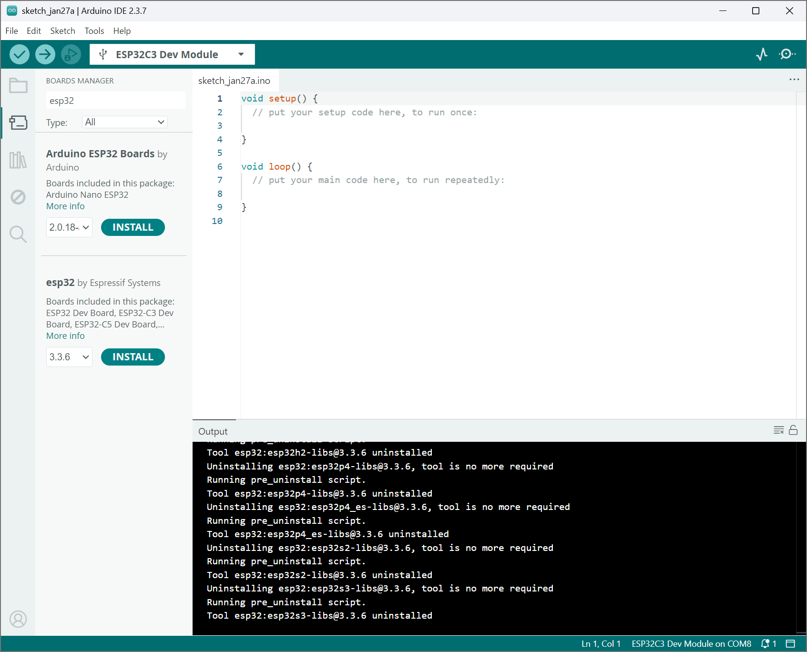
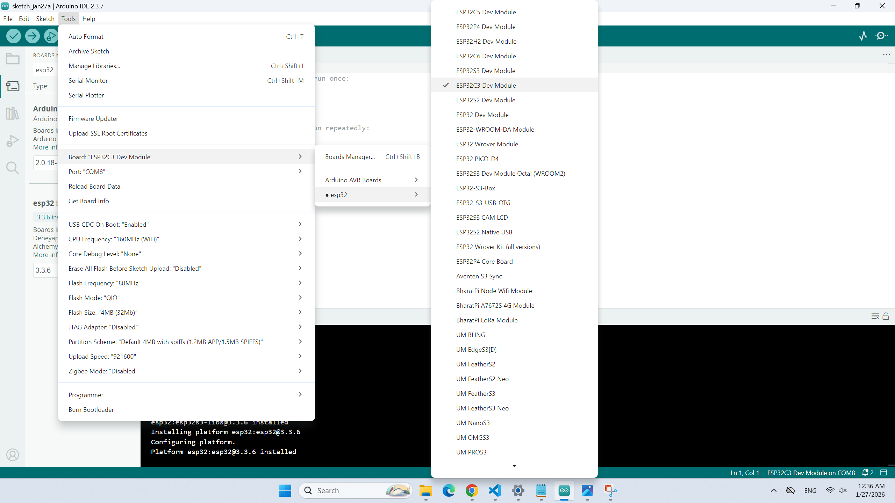

# 🚀 วิธีติดตั้ง Arduino IDE และ ESP32 สำหรับโปรเจกต์ IoT

> คู่มือฉบับสมบูรณ์สำหรับการติดตั้ง Arduino IDE และเพิ่มการสนับสนุนบอร์ด ESP32 เพื่อเริ่มพัฒนาโปรเจกต์ IoT ของคุณ

## 1. 📥 ดาวน์โหลดและติดตั้ง Arduino IDE
1. เข้าเว็บไซต์ [https://www.arduino.cc/en/software](https://www.arduino.cc/en/software)
2. เลือกดาวน์โหลด Arduino IDE ตามระบบปฏิบัติการของคุณ (Windows, Mac, Linux)
   <div align="center"></div>
3. ติดตั้งโปรแกรมตามขั้นตอนที่แนะนำ

## 2. 🔧 เปิด Arduino IDE
1. เปิดโปรแกรม Arduino IDE ที่ติดตั้งไว้

## 3. ⚙️ เพิ่มบอร์ด ESP32 ลงใน Arduino IDE
1. ไปที่เมนู **File > Preferences**
2. ที่ช่อง **"Additional Boards Manager URLs"** ให้ใส่ URL นี้:
   ```
   https://espressif.github.io/arduino-esp32/package_esp32_index.json
   ```
   <div align="center"></div>
3. กด **OK**

## 4. 📦 ติดตั้ง ESP32 Board
1. ไปที่ **Tools > Board > Boards Manager**
2. ค้นหา "ESP32"
   <div align="center"></div>
3. กด **Install** ที่ "esp32 by Espressif Systems"
4. รอจนติดตั้งเสร็จ

## 5. 🎯 เลือกบอร์ด ESP32
1. ไปที่ **Tools > Board**
2. เลือกบอร์ดที่ต้องการใช้งาน เช่น "ESP32 Dev Module" หรือ "ESP32C3 Dev Module"
   <div align="center"></div>
3. ไปที่ **Tools > USB CDC On Boot** แล้วเลือก **Enable** (เพื่อให้ Serial Monitor ใช้งานได้)

## 6. 🔌 ติดตั้งไดรเวอร์ (ถ้าจำเป็น)
- หากคอมพิวเตอร์ไม่เจอพอร์ต USB ของ ESP32 ให้ติดตั้งไดรเวอร์ CH340 หรือ CP210x ตามรุ่นบอร์ด

---

**💡 เคล็ดลับ:** หากพบปัญหาในการติดตั้ง สามารถดูคู่มือเพิ่มเติมได้ที่ [Arduino Official Website](https://www.arduino.cc/en/software) หรือ [ESP32 Documentation](https://docs.espressif.com/projects/arduino-esp32/en/latest/)

**📞 ติดต่อ:** หากมีคำถาม สามารถสอบถามได้ที่ [GitHub Issues](https://github.com/alfaXphoori/STEM/issues)

