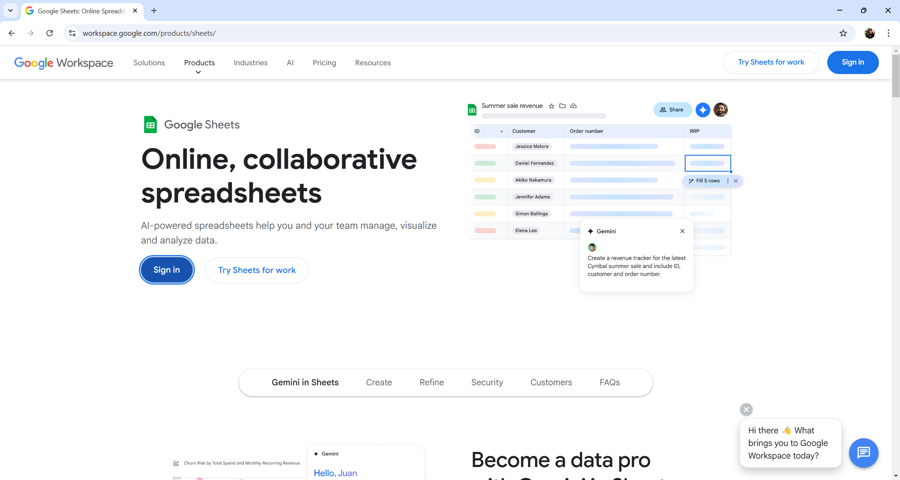
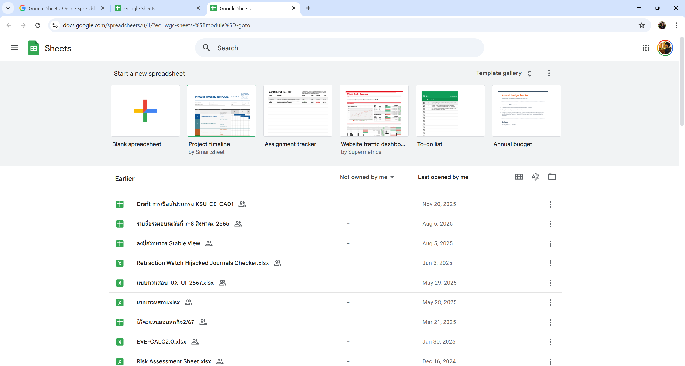
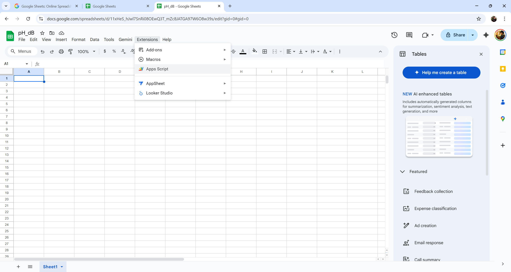
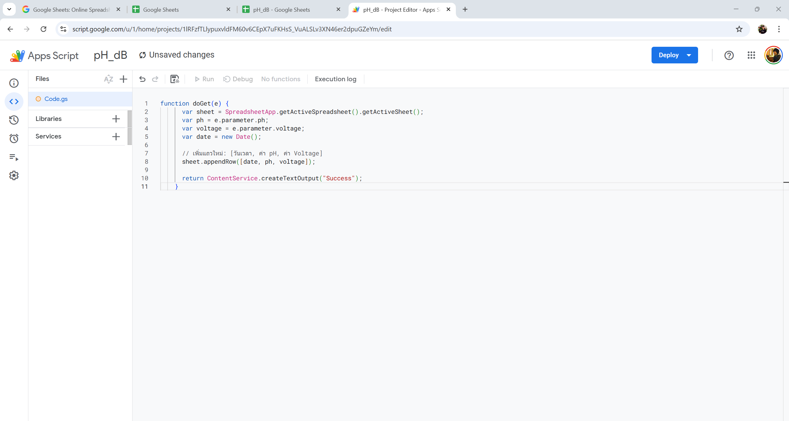
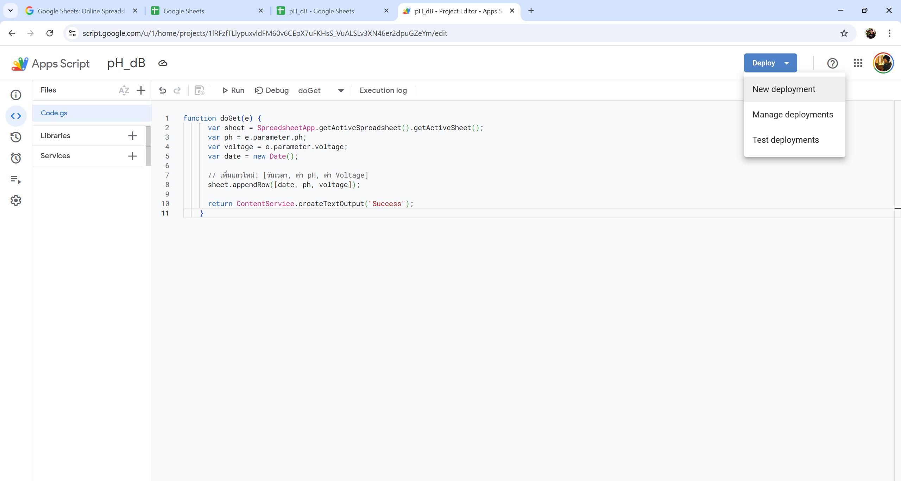
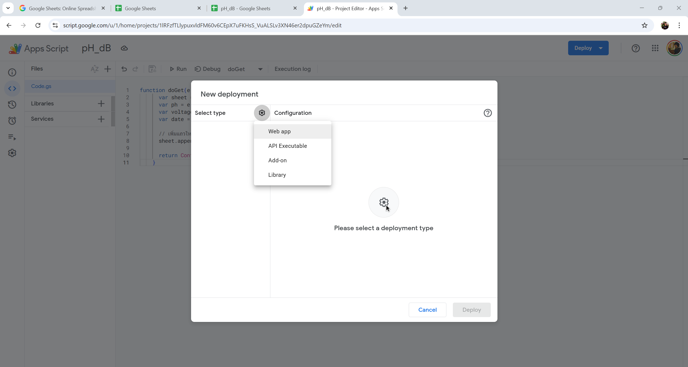
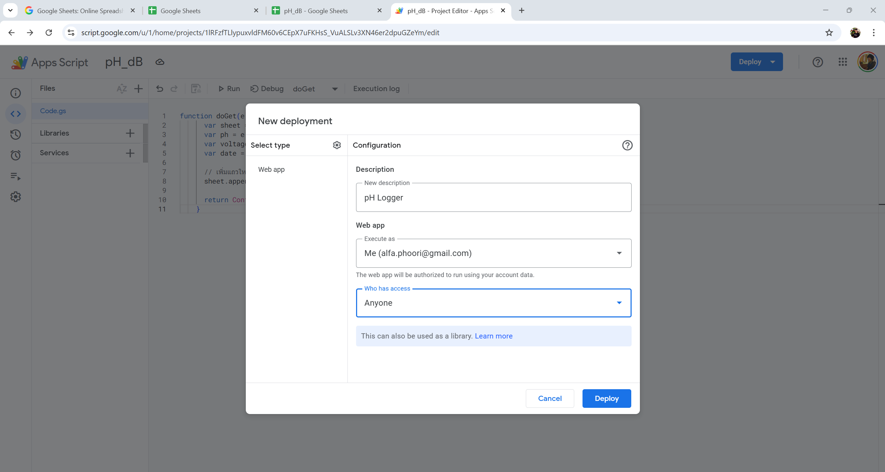
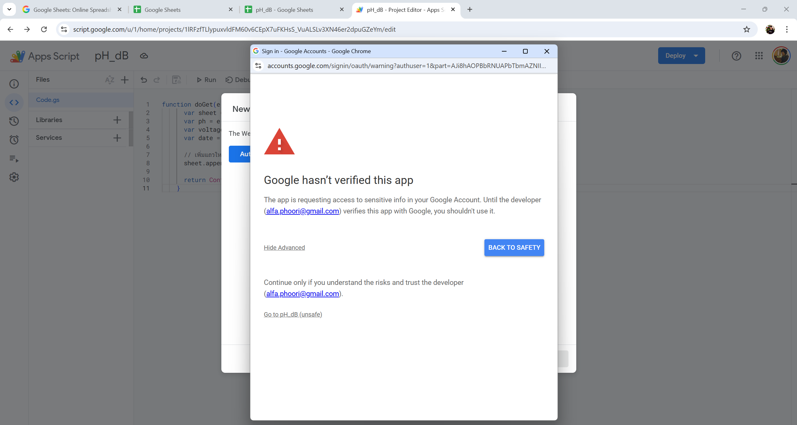
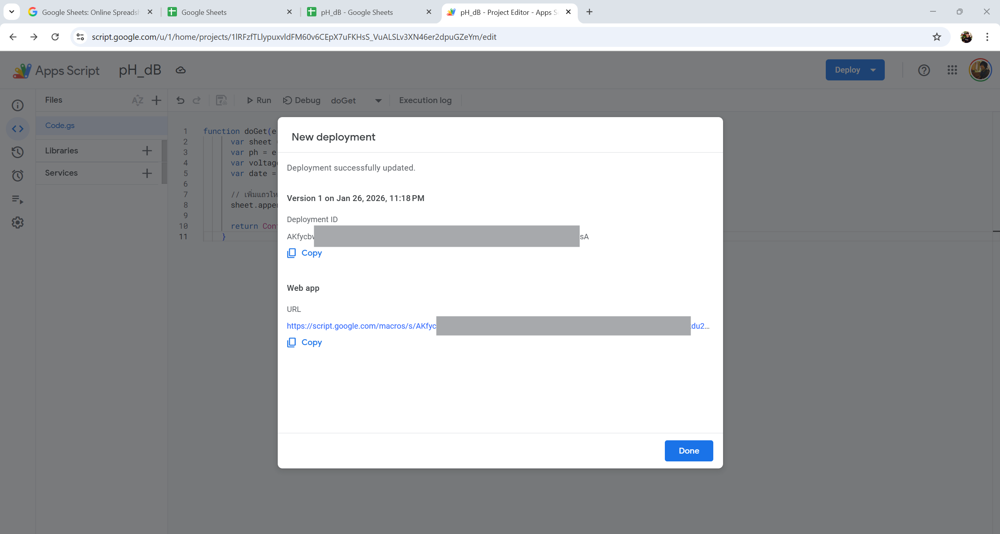
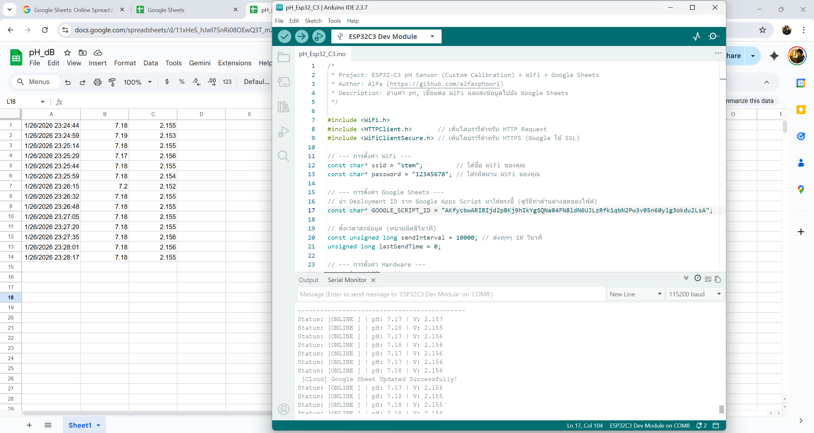

# ESP32-C3 pH Monitoring with WiFi


<div align="center">
  
  
  
</div>

---

## 📝 ขั้นตอนการใช้งาน


### 1. เข้า Google Sheets
ไปที่ https://workspace.google.com/products/sheets
<div align="center"></div>

### 2. สร้าง Sheet ใหม่
คลิก “+” เพื่อสร้าง Google Sheet เปล่า
<div align="center"></div>

### 3. เปลี่ยนชื่อ Sheet และเข้า App Script
เปลี่ยนชื่อ Sheet ตามต้องการ แล้วไปที่ Extensions > Apps Script
<div align="center"></div>

### 4. เปลี่ยนชื่อ Project และวางโค้ด
เปลี่ยนชื่อ Project (เช่น “pH Logger”) ลบโค้ดเดิมออก แล้ววางโค้ดนี้ลงไป:
<div align="center"></div>

```javascript
function doGet(e) { 
  var sheet = SpreadsheetApp.getActiveSpreadsheet().getActiveSheet();
  var ph = e.parameter.ph;
  var voltage = e.parameter.voltage;
  var date = new Date();
  sheet.appendRow([date, ph, voltage]);
  return ContentService.createTextOutput("Success");
}
```

### 5. กดปุ่ม “Deploy” > “New deployment”
<div align="center"></div>

### 6. ตรง “Select type” เลือก “Web app”
<div align="center"></div>

### 7. ตั้งค่าตามนี้
- Description: pH Logger
- Execute as: Me (ฉัน)
- Who has access: Anyone (ทุกคน)  
<div align="center"></div>

### 8. กด Deploy
### 9. Authorize access (ให้สิทธิ์การเข้าถึง)
<div align="center"></div>

### 10. กด Advance และ “Go to unsafe”
<div align="center"></div>

### 11. Copy Deployment ID มาใส่ในตัวแปร GOOGLE_SCRIPT_ID ในโค้ด Arduino
<div align="center"></div>

### 12. ข้อมูลจะถูกส่งไปเก็บไว้ใน Google Sheet เรียบร้อย
<div align="center"></div>

---

## 💻 ตัวอย่างโค้ด
```cpp
/*
 * Project: ESP32-C3 pH Sensor (Custom Calibration) with WiFi
 * Author: Alfa (https://github.com/alfaxphoori)
 * Description: อ่านค่า pH โดยใช้การเทียบค่าแบบ 3 จุด และเชื่อมต่อ WiFi
 */

#include <WiFi.h> // เรียกใช้ไลบรารี WiFi

// --- การตั้งค่า WiFi ---
const char* ssid = "stem";     // ใส่ชื่อ WiFi ของคุณ
const char* password = "12345678"; // ใส่รหัสผ่าน WiFi ของคุณ

// --- การตั้งค่า Hardware ---
// หมายเหตุ: เช็คว่าบอร์ดของคุณ Map ขา A1 เป็น GPIO เบอร์ไหน 
// หาก Compile ไม่ผ่าน ให้เปลี่ยน A1 เป็นเลขขา GPIO โดยตรง เช่น 0, 1, 2, 3 หรือ 4
const int phPin = A1; 

// --- ค่าคงที่ของระบบ ---
const float ESP_ADC_VOLTAGE = 3.3; // แรงดันอ้างอิงของ ESP32 (V)
const int ADC_RESOLUTION = 4095;   // ความละเอียด 12-bit (0 - 4095)

// --- ข้อมูล Calibration (จากการวัดจริงหน้างาน) ---
const float V_PH7  = 2.186; // แรงดันที่วัดได้ตอนจุ่ม pH 7.0
const float V_PH1  = 2.537; // แรงดันที่วัดได้ตอนจุ่ม pH 1.0 (Acid)
const float V_PH14 = 0.980; // แรงดันที่วัดได้ตอนจุ่ม pH 14.0 (Base)

void setup() {
  Serial.begin(115200);
  
  // ตั้งค่าความละเอียดการอ่านเป็น 12-bit
  analogReadResolution(12);
  
  // ตั้งค่า Attenuation เป็น 11dB เพื่อให้อ่านค่าได้กว้างขึ้น
  analogSetAttenuation(ADC_11db);
  
  Serial.println("---------------------------------------------");
  Serial.println("ESP32-C3 pH Meter Started");
  Serial.println("Author: Alfa");
  Serial.println("Calibration Mode: 3-Point Piecewise Linear");
  
  // --- เริ่มการเชื่อมต่อ WiFi ---
  Serial.print("Connecting to WiFi: ");
  Serial.println(ssid);
  WiFi.begin(ssid, password);

  while (WiFi.status() != WL_CONNECTED) {
    delay(500);
    Serial.print(".");
  }

  Serial.println("");
  Serial.println("WiFi Connected!");
  Serial.print("IP Address: ");
  Serial.println(WiFi.localIP());
  Serial.println("---------------------------------------------");
}

/*
 * ฟังก์ชันคำนวณค่า pH จากแรงดัน (Voltage)
 * ใช้สมการเส้นตรง y = mx + c แยกตามช่วง (Piecewise)
 */
float getPH(float voltage) {
  float slope;
  
  // กรณีเป็นกรด (Acidic Range): Voltage สูงกว่าค่ากลาง (pH 7)
  if (voltage > V_PH7) { 
    // คำนวณความชัน (Slope) ช่วง pH 1 ถึง pH 7
    slope = (7.0 - 1.0) / (V_PH7 - V_PH1); 
    
    // คำนวณค่า pH
    return 7.0 + slope * (voltage - V_PH7);
  } 
  // กรณีเป็นด่าง (Basic Range): Voltage ต่ำกว่าหรือเท่ากับค่ากลาง
  else { 
    // คำนวณความชัน (Slope) ช่วง pH 7 ถึง pH 14
    slope = (14.0 - 7.0) / (V_PH14 - V_PH7); 
    
    // คำนวณค่า pH
    return 7.0 + slope * (voltage - V_PH7);
  }
}

void loop() {
  // 1. อ่านค่า ADC แบบหาค่าเฉลี่ย (Smoothing) ลด Noise
  unsigned long totalAdc = 0;
  int sampleCount = 30; // จำนวนครั้งที่สุ่มอ่าน

  for(int i = 0; i < sampleCount; i++) {
    totalAdc += analogRead(phPin);
    delay(5); // หน่วงเวลาสั้นๆ ระหว่างการอ่านแต่ละครั้ง
  }
  
  // หาค่าเฉลี่ย ADC
  float avgAdc = totalAdc / (float)sampleCount;
  
  // 2. แปลง ADC เป็น Voltage
  float voltage = avgAdc * (ESP_ADC_VOLTAGE / ADC_RESOLUTION);

  // 3. แปลง Voltage เป็น pH ผ่านฟังก์ชันที่เขียนไว้
  float currentPH = getPH(voltage);

  // 4. จำกัดขอบเขตค่า (Clamping) ไม่ให้หลุดช่วง 0-14
  if (currentPH < 0) currentPH = 0;
  if (currentPH > 14) currentPH = 14;

  // 5. แสดงผลผ่าน Serial Monitor พร้อมสถานะ WiFi
  String wifiStatus = (WiFi.status() == WL_CONNECTED) ? "ONLINE " : "OFFLINE";
  
  Serial.print("Status: [");
  Serial.print(wifiStatus);
  Serial.print("] | Raw ADC: ");
  Serial.print((int)avgAdc);
  Serial.print(" | Voltage: ");
  Serial.print(voltage, 3);
  Serial.print(" V | pH: ");
  Serial.println(currentPH, 2); 

  // ถ้า Offline ให้พยายามต่อใหม่
  if (WiFi.status() != WL_CONNECTED) {
    // พยายาม Reconnect (ESP32 ปกติจะ Auto-reconnect อยู่แล้ว แต่ใส่เพื่อความชัวร์)
    WiFi.disconnect();
    WiFi.reconnect();
  }

  delay(1000); // อ่านค่าทุกๆ 1 วินาที
}
```

---

